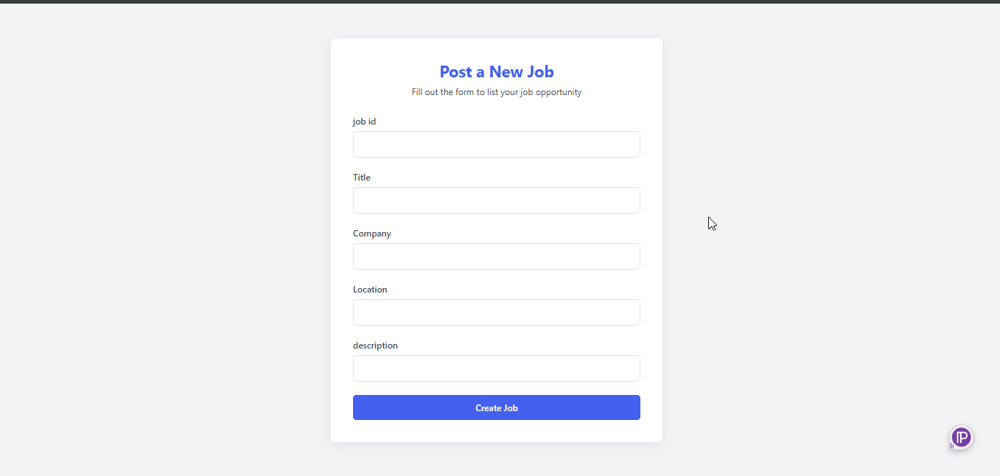
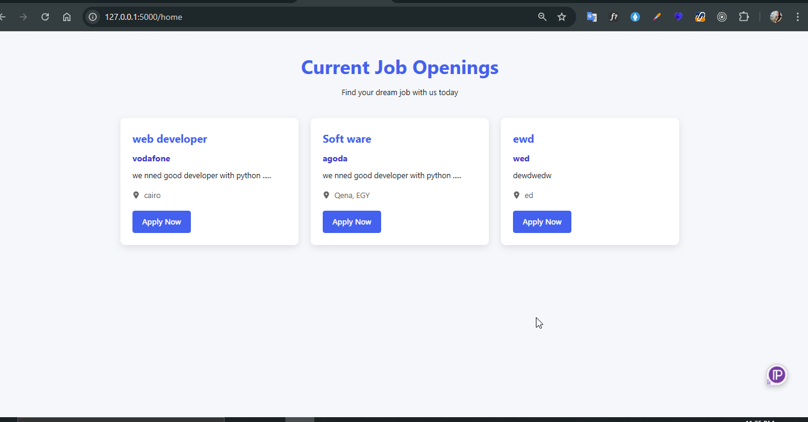

# 🧾 Flask Job Board App

This is a simple job posting board built with **Flask**, **WTForms**, and **SQLAlchemy**. Users can post job listings and view them in a clean UI.

---

## 📸 Screenshots

### 🎯 Job Posting Form



### 📋 All Jobs Listing



### 🔍 Job Details Page


---

## 🚀 Features

- Create new job postings
- View a list of all jobs
- View job details by ID
- Form validation with Flask-WTF
- SQLite integration with SQLAlchemy
- Responsive UI with clean design


## 🛠️ How to Run

1. Clone the repo:

```bash
git clone https://github.com/EsraaAbas/flask-job-board-.git
cd flask-job-board-
